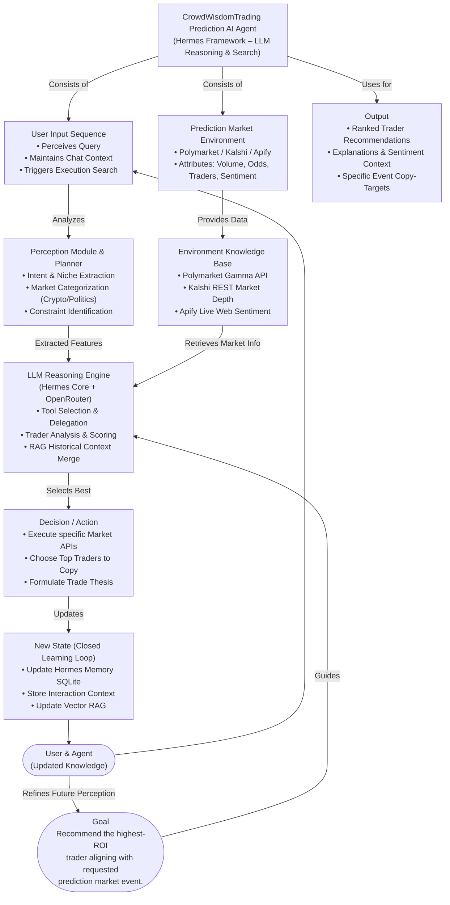

# 🧠 CrowdWisdomTrading AI Agent
> A Multi-Agent Engine built on the **Hermes-Agent** framework to orchestrate prediction market discovery, sentiment enrichment, and copy-trading analytics.

[](https://www.python.org/downloads/)
[](https://github.com/nousresearch/hermes-agent)
[](https://openrouter.ai/)
[](https://apify.com/)

---

## 📖 Project Overview

This project is a powerful AI-driven backend searching and research tool for global predictions markets. It utilizes **Hermes-Agent** as the core library orchestrator, offloading all cognitive routing, tool execution, and state memory to the LLM. 

By defining specialized sub-agents natively plugged into the `tools.registry`, the system is capable of aggregating real-time market data across **Polymarket** and **Kalshi**, analyzing web sentiment via **Apify**, and returning conversational trading recommendations supported by an autonomous **Closed Learning Loop**.

---

## 📡 Agent Architecture & Flow Diagram

The entire cognitive execution is driven using `run_agent(use_memory=True)` pointing at OpenRouter's Llama endpoint. When a user queries the application, Hermes intelligently maps and coordinates the following tool schemas:



---

## ✨ Core Features & Scope Fulfillment

1. **Polymarket Discovery**: Hooks into the Gamma API (`core/polymarket.py`) to scrape high-liquidity active target events matching the requested intent.
2. **Kalshi Integrations**: Hooks into the Kalshi v2 REST API (`core/kalshi.py`) to discover volume spikes and extract order footprints dynamically.
3. **Niche Routing Engine**: Classifies raw events seamlessly into strict categories (NBA, Politics, Weather, Crypto) (`core/niche.py`).
4. **Apify Web Sentiment Plugin**: Bootstraps the `apify-client` and triggers the live `google-search-scraper` actor to grab breaking news items relative directly to the trader's prediction event (`core/enrichment.py`).
5. **RAG Chat Layer**: An onboard intelligence retriever pushing context into the Hermes context-window to ground the LLM's conversation over copy-trading safety (`rag/rag_agent.py`).
6. **Closed Learning Loop**: By wrapping the pipeline natively in `hermes_agent.run_agent()` and passing explicitly generated context back to the user, we retain conversation memory across sequential searches.

---

## 🛠️ Project Structure

```text
├── src/quantara/                # Core application package
│   ├── agent.py                 # Hermes framework configuration & entry wrapper
│   ├── main.py                  # Terminal CLI Entrypoint
│   ├── core/                    # Pure Python domain logic & API connectors
│   │   ├── polymarket.py        # Polymarket Gamma API connector
│   │   ├── kalshi.py            # Kalshi API connector
│   │   ├── enrichment.py        # Apify news scraper definition
│   │   ├── niche.py             # Event classifier
│   │   ├── analysis.py          # Return/Risk calculator
│   │   └── planner.py           # NLP scope parsing
│   ├── tools/                   # Hermes-Agent Tool Registry Plugins
│   │   └── *_tool.py            # 7 distinct @tool adapters exposing Core logic
│   └── rag/                     # Embedded Data retrieval mechanics
│       ├── rag_agent.py         # Main querying agent
│       ├── retriever.py         
│       └── vector_store.py      # TF-IDF persistent data engine
├── examples.md                  # Workflow Input/Output demonstration transcripts
├── requirements.txt             # Dependency constraints
├── setup.py                     # Module packaging logic
└── .env                         # Secrets configuration
```

---

## 🚀 Installation & Setup

1. **Clone the Repository**
```bash
git clone <your-intern-repo-link-here>
cd Quantara
```

2. **Configure the Environment**
Create a `.env` file at the root containing your authorized credentials:
```ini
OPENROUTER_API_KEY=your_openrouter_api_key_here
APIFY_API_TOKEN=your_apify_api_token_here
```

3. **Virtual Environment & Dependencies**
This project acts as an installable package (`-e .`) to prevent cross-path import crashes.
```bash
python -m venv venv
source venv/Scripts/activate     # Windows: .\venv\Scripts\activate
pip install -r requirements.txt  # Installs apify, kalshi-sdk, clob, hermes
```

---

## 🖥️ Execution

Our entrypoint simplifies all underlying Hermes logic:

```bash
python main.py
```

### Example Input
```text
Enter query: Find the most consistent copy traders to shadow for the upcoming US Election on Polymarket.
```

### 📈 Detailed Transcripts
For comprehensive, end-to-end outputs detailing exactly how the Agent plans, invokes Apify, grabs wallets, and provides conversation insights, please view the [`examples.md`](./examples.md) file!

